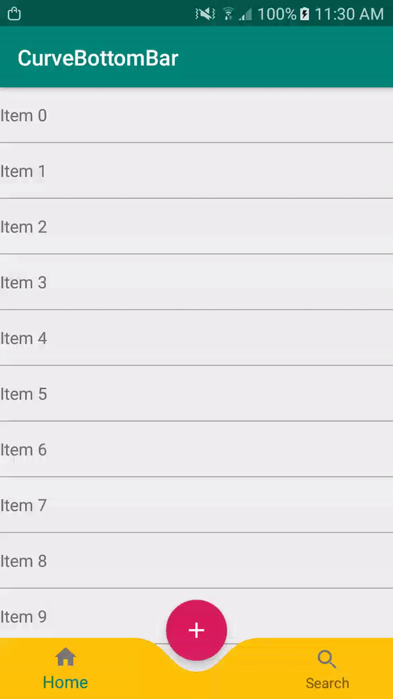

# Curve Bottom Bar




# Download

#### Add it to your build.gradle with:
```gradle
allprojects {
    repositories {
        maven { url "https://jitpack.io" }
    }
}
```
and:

```gradle
dependencies {
	        implementation 'com.github.Akshay-Katariya:CurveBottomBar:1.0'
	}
```

# Usage
```
<com.akshay.library.CurveBottomBar
                xmlns:cbb="http://schemas.android.com/apk/res-auto"
                android:id="@+id/customBottomBar"
                android:layout_width="match_parent"
                android:layout_height="56dp"
                app:itemIconTint="@color/grey"
                android:layout_gravity="bottom"
                cbb:bottomBarColor="@color/yellow"
                cbb:curveRadius="25dp"/>
```

# Customization options 
```
cbb:bottomBarColor="@color/yellow"
cbb:curveRadius="25dp"
```

#### You can even set values at runtime:
```
cbb.setBottomBarColor(getResources().getColor(R.color.yellow));
cbb.setCurveRadius(52);
```


Credit & Inspired by [IslamBesto](https://proandroiddev.com/how-i-drew-custom-shapes-in-bottom-bar-c4539d86afd7)

  