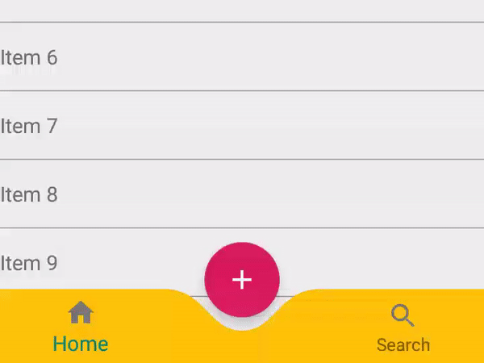

# Curve Bottom Bar

 

# Download

#### Add it to your build.gradle with:
```gradle
allprojects {
    repositories {
        maven { url "https://jitpack.io" }
    }
}
```
and:

```gradle
dependencies {
	        implementation 'com.github.Akshay-Katariya:CurveBottomBar:1.0'
	}
```

# Usage
```
<com.akshay.library.CurveBottomBar
            android:id="@+id/curveBottomBar"
            android:layout_width="match_parent"
            android:layout_height="56dp"
            app:itemIconTint="@color/grey"
            android:layout_gravity="bottom"
            app:bottomBarColor="@color/yellow"
            app:curveRadius="25dp"/>
```

# Customization options 
```
app:bottomBarColor="@color/yellow"
app:curveRadius="25dp"
```

#### You can even set values at runtime:
```
private CurveBottomBar cbb;

cbb = findViewById(R.id.customBottomBar);

cbb.setBottomBarColor(getResources().getColor(R.color.yellow));
cbb.setCurveRadius(52);
```

# License

Copyright 2018 Akshay Katariya

   Licensed under the Apache License, Version 2.0 (the "License");
   you may not use this file except in compliance with the License.
   You may obtain a copy of the License at

       http://www.apache.org/licenses/LICENSE-2.0

   Unless required by applicable law or agreed to in writing, software
   distributed under the License is distributed on an "AS IS" BASIS,
   WITHOUT WARRANTIES OR CONDITIONS OF ANY KIND, either express or implied.
   See the License for the specific language governing permissions and
   limitations under the License.

Credit & Inspired by [IslamBesto](https://proandroiddev.com/how-i-drew-custom-shapes-in-bottom-bar-c4539d86afd7)

  
